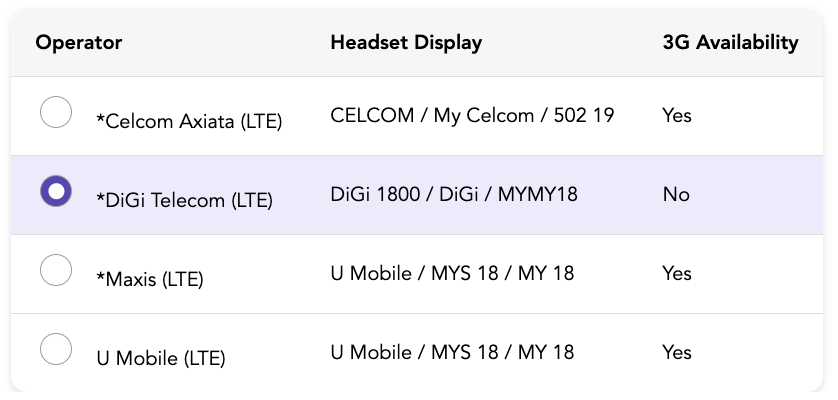

# Simple React Data Table

This is an easy-to-use React Data Table component simplifies the display of tabular data in your web applications. It's built with ReactJS and TypeScript, offering a straightforward setup and a clean user interface.

## Demo 

**Table Component**


**Table With Radio Button**


**Table With Checkbox**


## Tech Stack

### Core

* [Vite](https://vitejs.dev)
* [Typescript](https://www.typescriptlang.org/)
* [React](https://reactjs.org/)
* [Storybook](https://storybook.js.org)
* [Sass](https://sass-lang.com)

### Utils

* [prettier](https://prettier.io)
* [eslint](https://eslint.org)

## Usage

1. **Installation:**

   Install the component using yarn:

   ```bash
        yarn install    
    ``` 

2. **Run**:

    ```bash
        # Application 
        yarn dev
        # Storybook 
        yarn ios
    ```

2. **Other useful command**:
    ```bash
        # Prettier 
        yarn format

        # check eslint 
        yarn lint

        # unit test
        yarn test
    ```

## Usage
Display data in a clean and organized manner with just a few lines of code.

1. **Props**:

**data (required)**: An array of objects representing the data to be displayed.

**columns (required):** An array of objects representing the columns of the table.

**SelectMode:** To display checkbox or radio Button, default value is none.

2. **Enabling Sorting**:

To activate sorting for a particular column, designate the *sortable* property as true within the *columns* prop for that specific column.

3. **Responsive Design**:

The Table component boasts a responsive design that effortlessly adjusts to both desktop and mobile interfaces. It ensures a smooth user experience across a spectrum of screen dimensions.

4. **Theming**:

The theme can be change, in order to change the color of the table.


4. **Example**:

```typescript

import React from 'react';
import Table from './Table'

// Table Data
const tableData = [
    {
        id: 1,
        operator: '*Celcom Axiata (LTE)',
        headsetDisplay: 'CELCOM / My Celcom / 502 19',
        availability: 'Yes',
    },
    {
        id: 2,
        operator: '*DiGi Telecom (LTE)',
        headsetDisplay: 'DiGi 1800 / DiGi /  MYMY18',
        availability: 'No',
    },
    {
        id: 3,
        operator: '*Maxis (LTE)',
        headsetDisplay: 'U Mobile / MYS 18 / MY 18',
        availability: 'Yes',
    },
    {
        id: 4,
        operator: 'U Mobile (LTE)',
        headsetDisplay: 'U Mobile / MYS 18 / MY 18',
        availability: 'Yes',
    },
];

// Columns data
const tableColumns = [
    {
        id: 'operator',
        label: 'Operator',
        sortable: true,
    },
    {
        id: 'headsetDisplay',
        label: 'Headset Display',
        sortable: true,
    },
    {
        id: 'availability',
        label: '3G Availability',
    },
];

const MyApp: React.FC = () => {
  return (
    <Table
        data={datableData} 
        columns={tableColumns}
        {/* Use SelectMode Props to have radio or Checkbox */}
    />
  );
};

export default MyApp;

```